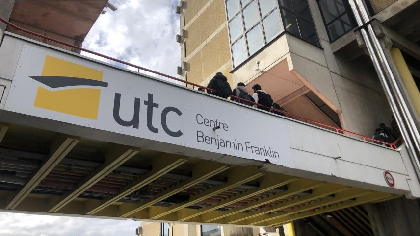

# MD Convertor

$meta-author=Quentin Anière
$meta-institute=UTC
$meta-date=Mercredi 9 Octobre 2024
$meta-uv=AI03
$meta-semester=A23

## What is it ?

 * An easy way to convert Markdown to LaTeX
 * Written in Python
 * With the UTC LaTeX themes

## How does it work ?

 * Like that !

## Image support

{width=0.8\textwidth}

## Note support

{width=0.6\textwidth}

>(Batiment Benjamin Franklin)Très joli batiment !!

## Multiple list

Liste A :

* ABC
* bon

Liste B : 

* yes
* youpi
